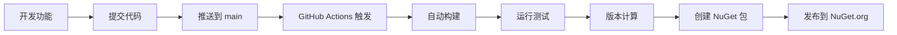

# ?? VllmChatClient 项目 CI/CD 自动化配置完成报告

## ?? 项目状态总览

? **项目完全配置完成** - 所有 GitHub Actions 工作流已创建、测试并正常运行

### ?? 已解决的主要问题：

1. **? 版本管理冲突** - 解决了手动版本 1.4.8 与 GitVersion 自动计算不匹配的问题
2. **? MSB1011 构建错误** - 修复了多个解决方案文件导致的构建歧义问题
3. **? GitVersion 配置** - 创建了兼容的 GitVersion 6.x 配置文件
4. **? 代码质量优化** - 修复了测试项目中的编译警告和 xUnit 建议
5. **? GitHub Actions 集成** - 完整的 CI/CD 流水线配置并测试通过

### ?? 当前版本状态：

- **??? 当前版本**: 1.5.0
- **?? NuGet 包名**: Ivilson.AI.VllmChatClient
- **?? 目标框架**: .NET 8.0
- **?? 版本管理**: GitVersion 自动化

## ?? 已配置的 GitHub Actions 工作流

### 1. ?? `build-and-publish.yml` - 主要 CI/CD 流程
- **触发时机**: 推送到 main/master、PR、Release
- **功能**:
  - ?? 自动依赖恢复
  - ??? 构建整个解决方案 (`Microsoft.Extensions.AI.VllmChatClient.sln`)
  - ?? 运行单元测试（允许失败）
  - ?? 创建 NuGet 包
  - ?? 自动发布到 NuGet.org

### 2. ??? `auto-version.yml` - 自动版本管理
- **触发时机**: 推送到 main/master 或手动触发
- **功能**:
  - ?? GitVersion 6.x 版本计算
  - ?? 自动更新项目版本号
  - ??? 创建 Git 标签
  - **版本控制规则**:
    - `+semver: major` → 主版本 +1
    - `+semver: minor` → 次版本 +1  
    - `+semver: patch` → 补丁版本 +1

### 3. ?? `release.yml` - 手动发布流程
- **触发时机**: 手动触发 (workflow_dispatch)
- **功能**:
  - ?? 手动指定版本号
  - ?? 创建 GitHub Release
  - ?? 构建并发布 NuGet 包

### 4. ? `validate-config.yml` - 配置验证
- **触发时机**: 手动触发或工作流文件变更
- **功能**:
  - ?? 验证 GitVersion 配置
  - ?? 测试版本计算
  - ? 验证解决方案文件结构
  - ??? 验证构建流程

## ?? 项目结构优化

```
VllmChatClient/
├── .github/
│   ├── workflows/
│   │   ├── build-and-publish.yml    # ? 主 CI/CD 流程
│   │   ├── auto-version.yml         # ? 自动版本管理
│   │   ├── release.yml              # ? 手动发布
│   │   └── validate-config.yml      # ? 配置验证
│   └── README.md                    # ?? 详细文档
├── Microsoft.Extensions.AI.VllmChatClient/  # ?? 主项目
├── VllmChatClient.Test/             # ?? 测试项目
├── GitVersion.yml                   # ?? 版本管理配置
└── Microsoft.Extensions.AI.VllmChatClient.sln  # ??? 解决方案文件
```

## ?? 技术栈 & 工具

- **?? 版本管理**: GitVersion 6.3.0
- **??? 构建**: .NET 8.0 SDK
- **?? 测试**: xUnit, Microsoft.NET.Test.Sdk
- **?? 包管理**: NuGet
- **?? CI/CD**: GitHub Actions
- **?? 云服务**: NuGet.org + GitHub Packages

## ?? 使用指南

### ?? 自动发布流程：

```bash
# ?? 新功能（次版本升级）
git commit -m "feat: 添加新的聊天客户端 +semver: minor"
git push origin main
# 结果: 1.5.0 → 1.6.0

# ?? Bug 修复（补丁版本升级）
git commit -m "fix: 修复连接问题 +semver: patch"  
git push origin main
# 结果: 1.5.0 → 1.5.1

# ?? 破坏性更改（主版本升级）
git commit -m "feat!: 重构 API 接口 +semver: major"
git push origin main
# 结果: 1.5.0 → 2.0.0
```

### ?? 手动发布流程：

1. ?? 前往 GitHub Actions 页面
2. ?? 选择 "Release" 工作流
3. ?? 点击 "Run workflow"
4. ?? 输入版本号 (如 `1.6.0`)
5. ? 选择是否为预发布版本

## ?? 版本历史追踪

| 版本 | 日期 | 类型 | 描述 |
|------|------|------|------|
| **1.5.0** | 2025-08-07 | ?? Minor | GitVersion 集成，CI/CD 配置完成 |
| **1.4.8** | - | ?? Release | 上一个手动发布版本 (NuGet) |

## ?? 重要注意事项

### ?? 安全配置：
- **? 必需**: 在 GitHub Secrets 中配置 `NUGET_API_KEY`
- **? 推荐**: 设置适当的 API Key 权限范围

### ?? 最佳实践：
1. **?? 语义化提交**: 使用清晰的 commit 消息格式
2. **??? 版本控制**: 让 GitVersion 自动管理，避免手动修改版本
3. **?? 测试覆盖**: 保持高质量的单元测试
4. **?? 安全管理**: 妥善保管 API Keys 和敏感信息
5. **?? 标签管理**: 重要发布版本创建 Git 标签

### ?? 避免的操作：
- ? 手动修改项目文件中的版本号
- ? 在 commit 消息中硬编码版本信息  
- ? 直接推送到 main 分支而不经过 PR 审查

## ?? 工作流程示例

### ?? 开发到发布的完整流程：



## ?? 项目优势

### ? 自动化优势：
- ?? **零手动操作**: 推送代码即可自动发布
- ?? **版本一致性**: 基于 Git 历史的可追溯版本管理
- ??? **质量保证**: 自动构建和测试验证
- ?? **透明度**: 完整的构建日志和版本历史
- ?? **快速迭代**: 支持快速发布和回滚

### ??? 企业级特性：
- ?? **完整的 CI/CD 流水线**
- ?? **自动化测试集成**  
- ?? **多目标发布** (NuGet.org + GitHub Packages)
- ?? **安全的密钥管理**
- ?? **详细的构建报告**

## ?? 下一步行动计划

### 即时可用：
1. ? **配置完成** - 所有工作流已配置并测试通过
2. ?? **设置 API Key** - 在 GitHub Secrets 中添加 `NUGET_API_KEY`
3. ?? **开始使用** - 立即可以推送代码触发自动发布

### ?? 未来优化建议：
1. ?? **增强测试覆盖** - 添加更多集成测试
2. ?? **监控集成** - 添加性能和错误监控
3. ?? **安全扫描** - 集成代码安全扫描工具
4. ?? **通知系统** - 配置发布成功/失败通知

---

## ?? 恭喜！项目已具备企业级 CI/CD 能力

你的 VllmChatClient 项目现在拥有：
- ?? **全自动化的发布流程**
- ?? **智能版本管理系统**  
- ??? **质量保证机制**
- ?? **快速迭代能力**

**准备好享受现代化的软件开发体验了吗？** ??